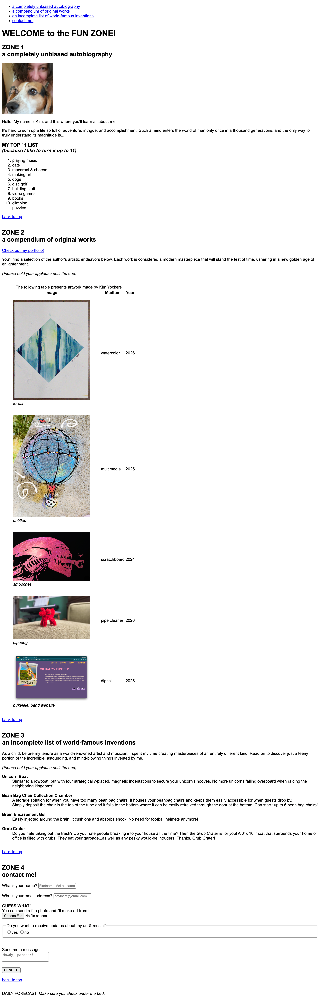

# HTML Basics — Kim Yockers

A single-page HTML5 demo built for ITD 210 (Web Page Design I)
at Northern Virginia Community College.

This page demonstrates the foundational HTML elements:
semantic landmarks, headings, lists, links, images,
tables, and a form with proper labels.

## Screenshot

## Files

- `index.html` — the assignment page
- `screenshot.png` — the page rendered in a browser
- `validator.png` — proof the page passes the W3C HTML validator

## Built with

HTML5. No CSS framework, no JavaScript.
